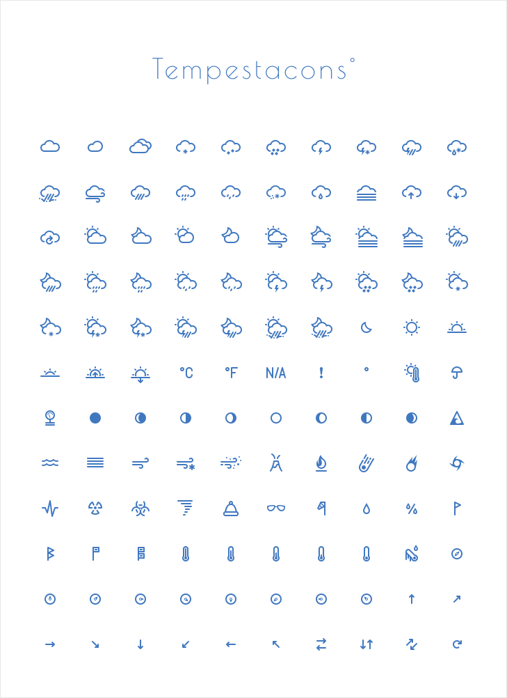

##Tempestacons

A set of 120 weather based svg icons.

###Rendering png's

The `render-pngs.sh` script will render png's from the `icons.svg` file by looping over the content of the `index.txt` file. Only id's inside the `index.txt` file will  be rendered.

* The script requires [Inkscape](https://inkscape.org/en/) and **sed**.

* The script will ask for an icon size (single number). If you skip it, the icons default dimensions will be used.

* The script will ask for an icon color. If you skip it, the default color will be used.

* The script doesn't overwrite files. Delete the file you want to ovewrite before executing the script.

* If you change the icon color swatch in the `icons.svg` file, update the `DEFULT_COLOR` variable inside the `render-pngs.sh` script, otherwise the script won't be able to change the png color during rendering.

###Pseudo-artboards

Since inkscape doesn't have artboards, the `icon.svg` file provides pseudo-artboard support by grouping each icon with a rectangle, which represents the icon's canvas (32x32 in this set.)

The groups are given id's which represent the name of the exported png.

**NOTE** Color swatches are provided in the `icons.svg` file for easily changing the icon and grid colors as well as for hiding the icon-canvas rectangles before exporting.
